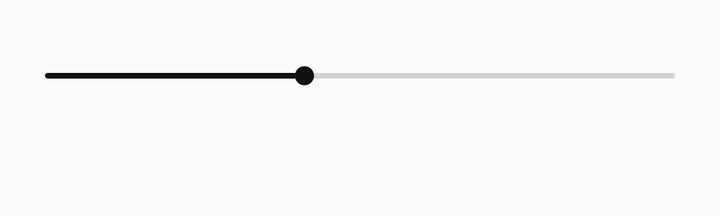

# Springy Bar

A scrub bar with a string in it. Drag sideways to scrub, push up or down to get it out of the way — and the further you push, the finer it scrubs.

One file, no dependencies, React 18+.



*Dragging with `reach={44}` so the bend is legible in a GIF; the default is 20.*

**[Live examples, on video and audio →](https://davidbastian.black/?p=springy-bar-product)**

```tsx
import { SpringyBar, springyBarCss } from './SpringyBar';

<style>{springyBarCss}</style>
<SpringyBar value={t} duration={d} onSeek={setT} />
```

---

## Where it came from

It started as [a study](https://davidbastian.black/?p=springy-bar) — a canvas sketch with a control panel, made to answer one question: what would a scrub bar feel like if it had physics in it. That is all a study has to do. It lived on a page of its own, it was fun to drag, and it was not usable by anyone.

Two things made it worth turning into a component. The first is that the thing it does is not decoration: pushing the bar out of the way solves a real problem with scrub bars, and the bend turns out to be a natural display for scrub precision — a gesture iOS has had for a decade and has never shown anyone. The second is that a scrub bar is not a rare control. It is one of the few every person uses every day, which means an idea about it either ships as something a developer can drop into a player in one line, or it stays a demo that people say is nice and then never think about again.

So the study stays where it is, as the sketch. This is the same idea rebuilt as a thing you can actually use: DOM and SVG instead of canvas, props instead of a panel, a real slider for screen readers, and gesture handling that does not fight the page it is on.

## Why

The scrub bar is one of the few controls everybody uses every day — YouTube, Twitch, a podcast app, the video in a message. Hundreds of millions of drags a day, on a control that has been a straight line with a dot on it since the first media player. Everything around it has been redesigned twenty times over. The bar has not moved.

It has two problems everyone has quietly accepted:

**It sits on top of the thing it is scrubbing.** Your finger and the bar together cover the bottom of the picture at the exact moment you are looking for a frame — the subtitle, the face, the scoreboard.

**It is as precise as the screen is wide.** On a phone, one pixel of thumb is several seconds of video, so landing on a word is luck.

## What the vertical axis is for

A hand reaching for a bar does not only move sideways. Push down and the string bends away from your finger, which does two things at once:

1. **The bar gets out of the way.** Whatever it was covering is visible while you scrub, which is when you need to see it.
2. **The scrub gets finer**, in proportion to how far you have pushed. At full reach a whole screen of travel is a quarter of what it was.

The second one is not new — iOS has had *slide your finger away to scrub slowly* for over a decade. What is new is being able to see it. That gesture is invisible on a straight bar, so you are meant to discover it, and most people never do. Here the bend **is** the display: how far the string is from home is how fine the scrub is, and you can see and feel it the whole time.

The spring is the rest of it. A control that answers your hand with weight is a different experience from one that jumps — and the note it makes when you let go, off by default, is the same idea one sense further along.

## Install

```bash
# One file. Copy it into your project:
curl -O https://raw.githubusercontent.com/davidbastian/springy-bar/main/src/SpringyBar.tsx
```

The CSS ships as a string in the same file, so there is no stylesheet to import:

```tsx
import { SpringyBar, springyBarCss } from './SpringyBar';

export function Player() {
  const [t, setT] = useState(0);
  return (
    <>
      <style>{springyBarCss}</style>
      <SpringyBar value={t} duration={180} onSeek={setT} />
    </>
  );
}
```

## On a video

Point it at a media element and give it back the seek:

```tsx
const v = useRef<HTMLVideoElement>(null);
const [t, setT] = useState(0);
const [playing, setPlaying] = useState(false);

<video ref={v} src="/clip.mp4" onPlay={() => setPlaying(true)} onPause={() => setPlaying(false)} />

<SpringyBar
  value={t}
  duration={v.current?.duration ?? 0}
  playing={playing}
  onPlayPause={() => (playing ? v.current!.pause() : v.current!.play())}
  onSeek={s => { setT(s); v.current!.currentTime = s; }}
  showTime
  accent="#ffffff"
  track="rgba(255,255,255,0.3)"
/>
```

## Props

| Prop | Type | Default | What it does |
| --- | --- | --- | --- |
| `value` | `number` | — | Where the playhead is, in the same unit as `duration`. |
| `duration` | `number` | — | How long the thing is. Left out, the bar runs 0 to 1. |
| `onSeek` | `(v: number) => void` | — | Called while dragging and on a keyboard seek. |
| `onSeekEnd` | `(v: number) => void` | — | Called once when the drag ends, if you would rather seek only then. |
| `onDragChange` | `(held: boolean) => void` | — | Told when the string is picked up and put down — for dimming or blurring whatever is behind the bar while you scrub. |
| `playing` | `boolean` | — | With `onPlayPause`, grows a play button on the left. |
| `onPlayPause` | `() => void` | — | Also bound to the space bar. |
| `buffered` | `number` | `0` | 0 to 1, drawn dim behind the played part. |
| `reach` | `number` | `20` | How far the string can be pushed, in pixels. `0` turns the bend off. |
| `limit` | `number` | `16` | The hard stop: the string never travels further than this, however far the finger does. `reach` is where it starts resisting; this is where it stops. |
| `room` | `number` | `40` | The control's own height — its hit area. Not derived from `reach`, so changing the give never resizes the bar; the string bends outside the box instead. |
| `stiffness` | `number` | `600` | The spring that brings it home. |
| `damping` | `number` | `20` | Lower is bouncier. |
| `precision` | `number` | `1.5` | At full reach the scrub runs this much slower. `1` turns it off. |
| `sound` | `boolean` | `false` | A short note when the string is released. |
| `accent` | `string` | `#111111` | The played part and the handle. |
| `track` | `string` | `rgba(0,0,0,0.16)` | The unplayed part. |
| `weight` | `number` | `3.5` | Thickness of the string. |
| `container` | `boolean` | `false` | Wraps the control in a pill: translucent fill, hairline, blur behind — for floating it over a picture. |
| `containerFill` / `containerBorder` | `string` | `rgba(0,0,0,0.30)` / `rgba(255,255,255,0.22)` | The pill's fill and hairline. Any CSS colour, so `rgba()` for translucency. |
| `containerRadius` | `number` | — | Corner radius of the pill. Left out, it is a capsule at any height. |
| `containerBlur` | `number` | `14` | How much of what is behind the pill is blurred. `0` for none — worth turning off over flat backgrounds, and the first thing to drop on a phone already decoding video. |
| `showTime` | `boolean` | `false` | Elapsed on the left, remaining on the right. |
| `meter` | `number` | — | A four-bar level on the right, 0 to 1. The component draws it; the number comes from whoever owns the audio. |
| `muted` / `onMute` | `boolean` / `() => void` | — | Give `onMute` and the meter becomes the mute button. Muted, its bars lie flat. |
| `tip` | `boolean` | `false` | A label above the handle while you drag. It rides the string, so it travels with the bend. |
| `preview` | `(v: number) => ReactNode` | — | Anything above that label — a frame, a chapter name, a marker. Called as often as the finger moves, so keep it cheap. |
| `actions` | `ReactNode` | — | Your own controls, on the right. |
| `label` | `string` | `Seek` | For screen readers. |

## How it works

**The spring**, integrated per frame:

```ts
const a = (target - bend) * stiffness - vel * damping;
vel  += a * dt;
bend += vel * dt;
```

`dt` is clamped to 32ms, so a tab that was in the background for a minute does not integrate a minute of spring in one frame.

**The string** is two bowed legs meeting under the finger. The played part is the same path under a clip, not a second shorter path: drawn separately the two can disagree by a pixel at the handle, and a scrub bar that shows its own seam is worse than a plain one.

**The precision** is the bend, read back:

```ts
const away = Math.min(1, Math.abs(bend) / reach);
const fine = 1 / (1 + away * (precision - 1));
seek(grabbedAt + (dx / width) * duration * fine);
```

**The gesture**, on a phone: a slider cannot share its gestures. With `touch-action: pan-y` the browser could claim the first touch as a scroll and fire `pointercancel`, which killed the drag before it began — the first touch did nothing and the second one worked. The whole control takes the gesture now (`touch-action: none`, on the container as well as the track, because the padding, the play button and the meter are all places a finger lands slightly off target), and the page is held by hand for as long as a finger is down, since a scroller already moving cannot be stopped by a property. All of it is gated on touch: a mouse never locks the page, and so never loses its scrollbar mid-drag.

**The length**: a phone browser treats `preload` as a suggestion and often fetches nothing until the first tap, so `duration` reads 0 and there is nothing to scrub across. Whatever owns the media should call `load()` and listen for `durationchange` as well as `loadedmetadata` — the demos do — and the bar refuses to seek while the length is unknown rather than silently landing on the first frame.

## Accessibility

The track is a real slider: `role="slider"`, `aria-valuenow`, `aria-valuetext` as a clock, arrow keys to seek, `Home` and `End` for the ends, and space for play/pause when `onPlayPause` is given. The spring never moves a value; it only draws. Under `prefers-reduced-motion` the handle stops animating its size.

## Licence

MIT © David Bastian
